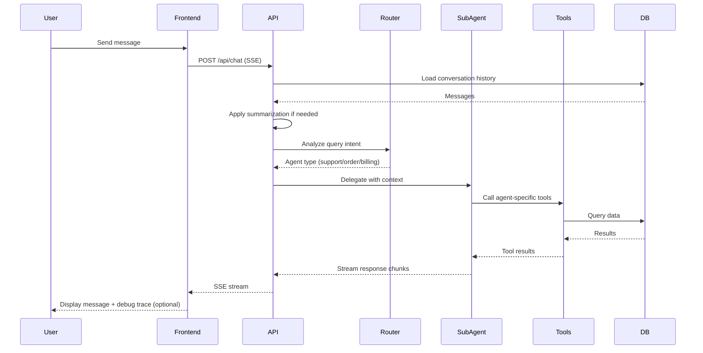

## Architectural Approach

### Monorepo Structure

**Decision: Turborepo with Apps + Shared Packages**

- One **Next.js** app for the product UI (and authentication).
- A reusable **Hono** API module (kept as a separate app/package boundary for clarity) and mounted under Next.js `/api/*` for same-origin deployment on Vercel.
- Shared packages for: cross-app types/schemas, Prisma/database, and UI primitives.

**Rationale:**

- Clear separation enables independent deployment and scaling
- Shared packages ensure type safety across frontend/backend boundary
- Database package centralizes schema and migrations
- UI package allows component reuse and consistent design system
- Turborepo provides fast builds with intelligent caching

### Backend Architecture

**Pattern: Controller-Service with Hono.dev**

**Controllers:** Handle HTTP concerns (request validation, response formatting, error handling)

- Thin layer, delegates to services
- Uses Zod for request/response validation
- Returns type-safe responses for RPC

**Services:** Contain business logic and orchestration

- Agent orchestration (router → sub-agent delegation)
- Context management and summarization
- Database operations via Prisma
- Tool execution coordination

**Middleware Stack:**

1. **Error Handler:** Global error catching, structured error responses
2. **Rate Limiter:** Token bucket algorithm, per-user limits (bonus feature)
3. **Auth Middleware:** JWT session validation (NextAuth), inject `userId` into request context
4. **CORS:** Same-origin by default (Next.js `/api/*`); restrict if external clients are introduced
5. **Logger:** Request/response logging for debugging

**Trade-offs:**

- Controller-Service adds a layer vs direct handlers, but improves testability and separation of concerns
- Middleware overhead is minimal and provides production-ready features

### API Design: Hybrid REST + RPC

**REST Endpoints (Assignment Compliance):**

```
POST   /api/chat/messages              # Send message, stream response
GET    /api/chat/conversations/:id     # Get conversation history
GET    /api/chat/conversations          # List user conversations
DELETE /api/chat/conversations/:id     # Delete conversation
GET    /api/agents                      # List available agents
GET    /api/agents/:type/capabilities   # Get agent capabilities
GET    /api/health                      # Health check
```

**Hono RPC (Type Safety Bonus):**

- CRUD operations exposed via RPC for type-safe client calls
- Frontend uses `hc` (Hono client) for end-to-end type inference
- RPC routes mirror REST but provide TypeScript contracts

**Rationale:**

- REST satisfies assignment requirements and follows standard patterns for chat APIs
- RPC demonstrates bonus feature (+30 points) and improves DX
- Hybrid approach gets best of both: standards compliance + type safety

### Multi-Agent Architecture

**Implementation: Vercel AI SDK Native**

**Router Agent:**

- Uses `generateText` with structured output (Zod schema)
- Analyzes query intent, returns agent type (support/order/billing)
- Fallback: defaults to Support Agent for unclear queries

**Sub-Agents (Support, Order, Billing):**

- Each uses `streamText` with agent-specific tools
- Tools defined using Vercel AI SDK's tool format
- Hybrid tool implementation:
  - **Shared tools:** `queryConversationHistory` (all agents)
  - **Agent-specific tools:**
    - Support: `searchFAQ` (FAQ data stored in DB; seeded)
    - Order: `getOrderDetails`, `checkDeliveryStatus`, `cancelOrder`
    - Billing: `getInvoiceDetails`, `checkRefundStatus` (via `Payment.refundStatus`), `getPaymentHistory`

**Tool Execution Flow:**

1. Agent calls tool during generation
2. Tool function queries database via service layer
3. Results injected back into LLM context
4. Agent generates response with tool data

**Rationale:**

- Native SDK approach minimizes abstraction, follows proven patterns
- Structured output for routing ensures reliable delegation
- Tool specialization demonstrates multi-agent benefits clearly

### Context Management & Summarization

**Strategy: Sliding Window + Summary**

**Implementation:**

1. Load full conversation from database
2. If message count > 10:
  - Keep last 10 messages in full detail
  - Summarize messages 1 to N-10 using LLM
  - Store summary in `ConversationSummary` table
  - Send [summary, ...last10Messages] to agent
3. If message count ≤ 10: send all messages

**Summarization Prompt:**

```
"Summarize the following conversation history concisely, 
preserving key context, user preferences, and unresolved issues."
```

**Rationale:**

- Demonstrates context compaction bonus feature clearly
- Sliding window maintains recent context quality
- Predictable behavior (always 10 recent messages)
- Reduces token usage while preserving conversation continuity

### Authentication & Authorization

**NextAuth.js (Next.js App Router) with Google OAuth**

**Integration approach:**

- Auth handled in the Next.js app via standard NextAuth route handlers under `/api/auth/*`.
- Backend API is served under the same origin (`/api/*`) so session cookies work without CORS friction.
- **Session strategy:** JWT-only (stateless), with user identity derived from the NextAuth JWT (`sub`).
- API middleware validates the JWT (or uses NextAuth helpers) and injects `userId` into request context.

**User Isolation:**

- All conversations scoped to `userId`
- Database queries filtered by authenticated user
- Prevents cross-user data access

**Rationale:**

- NextAuth.js is production-ready, handles OAuth complexity
- Google provider is familiar, easy to set up
- JWT sessions work well with serverless (Vercel)

### Frontend Architecture

**Next.js (React) + TypeScript + Tailwind + shadcn/ui**

**State Management:**

- **Chat State:** Vercel AI SDK's `useChat` hook
  - Handles messages, streaming, loading states
  - Automatic optimistic updates
  - Built-in error handling
- **Global State:** Zustand stores
  - `useAuthStore`: User session, login/logout
  - `useUIStore`: Sidebar state, theme, modals

**Component Structure:**

- **Pages:** Chat, Conversations, Login
- **Layouts:** AppLayout (with sidebar), AuthLayout
- **Features:** ChatInterface, ConversationList, MessageBubble, AgentIndicator
- **UI Components:** shadcn/ui primitives (Button, Card, Input, etc.)

**Accessibility:**

- ARIA labels on interactive elements
- Keyboard navigation support
- Screen reader announcements for new messages
- Focus management in modals

**Rationale:**

- useChat eliminates custom streaming logic
- Zustand is lightweight, perfect for auth/UI state
- shadcn/ui provides accessible components out of the box
- Tailwind enables rapid, responsive styling

### Streaming & Real-Time Features

**Server-Sent Events (SSE) via Vercel AI SDK**

**Endpoint strategy (validated):**

- Canonical AI SDK streaming endpoint: `POST /api/chat` (best compatibility with `useChat`).
- Assignment endpoints remain: `POST /api/chat/messages` exists as a thin wrapper that calls the same underlying chat service.
- `GET /api/chat/conversations*` and `DELETE /api/chat/conversations/:id` remain per assignment; internally they can be implemented via shared handlers used by both REST and RPC adapters.

**Flow:**

1. Frontend calls `POST /api/chat` with `useChat` (SSE)
2. Backend streams response using `streamText`
3. Frontend receives chunks, updates UI in real-time
4. Loading state shows "Agent is typing..." indicator

**AI “Reasoning” / Debug Display (Bonus, validated):**

- Display a **safe action trace** (not raw chain-of-thought): selected agent, tool calls made, and a short high-level decision rationale.
- Render as an expandable “Debug” panel per assistant message.
- Persist the trace in `Message.debugTrace` (JSON) for replay and demoability.

**Rationale:**

- SSE is standard for AI streaming, well-supported
- useChat handles all complexity (reconnection, buffering)
- Reasoning display demonstrates understanding of agent internals

### Rate Limiting (Bonus Feature)

**Implementation: Token Bucket Algorithm**

**Limits:**

- 20 requests per minute per user
- 100 requests per hour per user
- Middleware checks limits before processing

**Storage (validated for Vercel):** Vercel KV / Upstash Redis (default). In-memory Map is dev-only and not reliable in serverless.

**Rationale:**

- Demonstrates production awareness
- Prevents abuse, protects LLM API costs
- Simple to implement, quick win for bonus points

### Error Handling

**Middleware-Based Approach:**

**Error Types:**

1. **Validation Errors:** 400 with Zod error details
2. **Auth Errors:** 401 unauthorized
3. **Rate Limit Errors:** 429 with retry-after header
4. **LLM API Errors:** 503 with retry logic
5. **Database Errors:** 500 with sanitized message

**Frontend Error Boundaries:**

- Catch React errors, show fallback UI
- Toast notifications for API errors
- Retry mechanisms for transient failures

**Rationale:**

- Centralized error handling ensures consistency
- Structured errors improve debugging
- User-friendly messages improve UX

### Testing Strategy

**Unit Tests (Vitest):**

- Service layer logic
- Tool functions
- Utility functions (summarization, validation)

**Integration Tests (Vitest + Prisma):**

- API endpoints with test database
- Agent orchestration flows
- Auth middleware

**E2E Tests (Playwright):**

- Critical user flows (login, send message, view conversations)
- Streaming behavior
- Error scenarios

**Coverage Target:** 70%+ for services and controllers

**Rationale:**

- Demonstrates code quality (bonus feature)
- Vitest is fast, modern, and works well with TypeScript/Next.js projects
- Playwright provides reliable E2E testing
- Focus on high-value tests given time constraints

### Deployment Strategy

**Vercel Deployment (validated):**

- Deploy a single **Next.js** application.
- Mount the **Hono** API under the same Next.js project’s `/api/*` so chat streaming + auth cookies are same-origin.
- Configure runtime to support streaming (SSE) and Prisma access; plan for serverless-safe DB connection pooling (e.g., hosted Postgres with pooling/accelerator).
- Environment variables include DB URL, Groq API key, model name, NextAuth secrets, and KV/Redis connection for rate limiting.

**Database:**

- PostgreSQL on Vercel Postgres / Supabase (or equivalent)
- Prisma migrations run on deploy
- Seed data populated automatically

**Rationale:**

- Vercel is optimal for monorepo deployment
- Serverless scales automatically
- Simple CI/CD with GitHub integration
- Demonstrates live deployment bonus

---

## Data Model

### Database Schema (Prisma)

#### Core Entities

**User (NextAuth Prisma Adapter compatible; JWT sessions)**

```prisma
model User {
  id            String         @id @default(cuid())
  name          String?
  email         String?        @unique
  emailVerified DateTime?
  image         String?

  // NextAuth adapter relations
  accounts      Account[]

  // App relations
  conversations Conversation[]
  orders        Order[]
  payments      Payment[]
  invoices      Invoice[]

  createdAt     DateTime       @default(now())
  updatedAt     DateTime       @updatedAt
}

model Account {
  id                 String  @id @default(cuid())
  userId             String
  user               User    @relation(fields: [userId], references: [id], onDelete: Cascade)
  type               String
  provider           String
  providerAccountId  String
  refresh_token      String?
  access_token       String?
  expires_at         Int?
  token_type         String?
  scope              String?
  id_token           String?
  session_state      String?

  @@unique([provider, providerAccountId])
  @@index([userId])
}
```

**Conversation**

```prisma
model Conversation {
  id        String    @id @default(cuid())
  userId    String
  user      User      @relation(fields: [userId], references: [id], onDelete: Cascade)
  title     String?   // Auto-generated from first message
  createdAt DateTime  @default(now())
  updatedAt DateTime  @updatedAt
  messages  Message[]
  summary   ConversationSummary?
  
  @@index([userId, updatedAt])
}
```

**Message**

```prisma
model Message {
  id             String       @id @default(cuid())
  conversationId String
  conversation   Conversation @relation(fields: [conversationId], references: [id], onDelete: Cascade)
  role           String       // "user" | "assistant" | "system"
  content        String       @db.Text
  agentType      String?      // "router" | "support" | "order" | "billing"
  toolCalls      Json?        // Structured tool-call trace
  debugTrace     Json?        // Safe "action trace" (agent choice, tool calls, short rationale)
  createdAt      DateTime     @default(now())

  @@index([conversationId, createdAt])
}
```

**ConversationSummary**

```prisma
model ConversationSummary {
  id             String       @id @default(cuid())
  conversationId String       @unique
  conversation   Conversation @relation(fields: [conversationId], references: [id], onDelete: Cascade)
  summary        String       @db.Text
  messageCount   Int          // Number of messages summarized
  createdAt      DateTime     @default(now())
  updatedAt      DateTime     @updatedAt
}
```

#### Mock Data Entities (for Agent Tools)

**FAQArticle**

```prisma
model FAQArticle {
  id        String   @id @default(cuid())
  slug      String   @unique
  title     String
  content   String   @db.Text
  tags      String[]
  createdAt DateTime @default(now())
  updatedAt DateTime @updatedAt
}
```

**Order**

```prisma
model Order {
  id              String   @id @default(cuid())
  orderNumber     String   @unique

  userId          String
  user            User     @relation(fields: [userId], references: [id], onDelete: Cascade)

  status          String   // "pending" | "shipped" | "delivered" | "cancelled"
  items           Json     // Array of {name, quantity, price}
  total           Float
  trackingNumber  String?
  estimatedDelivery DateTime?

  payments        Payment[]
  invoices        Invoice[]

  createdAt       DateTime @default(now())
  updatedAt       DateTime @updatedAt

  @@index([userId])
  @@index([orderNumber])
}
```

**Payment**

```prisma
model Payment {
  id            String   @id @default(cuid())

  userId        String
  user          User     @relation(fields: [userId], references: [id], onDelete: Cascade)

  orderId       String?
  order         Order?   @relation(fields: [orderId], references: [id], onDelete: SetNull)

  amount        Float
  currency      String   @default("USD")
  status        String   // "completed" | "pending" | "failed" | "refunded"
  refundStatus  String?  // e.g., "requested" | "processing" | "refunded" | "rejected"

  method        String   // "credit_card" | "paypal" | "stripe"
  transactionId String   @unique
  createdAt     DateTime @default(now())

  @@index([userId])
  @@index([orderId])
  @@index([transactionId])
}
```

**Invoice**

```prisma
model Invoice {
  id            String   @id @default(cuid())
  invoiceNumber String   @unique

  userId        String
  user          User     @relation(fields: [userId], references: [id], onDelete: Cascade)

  orderId       String?
  order         Order?   @relation(fields: [orderId], references: [id], onDelete: SetNull)

  amount        Float
  status        String   // "paid" | "pending" | "overdue"
  dueDate       DateTime
  paidAt        DateTime?
  pdfUrl        String?  // Mock URL

  createdAt     DateTime @default(now())

  @@index([userId])
  @@index([orderId])
  @@index([invoiceNumber])
}
```

### Relationships

- **User → Conversations:** One-to-many (user can have multiple conversations)
- **Conversation → Messages:** One-to-many (conversation contains multiple messages)
- **Conversation → Summary:** One-to-one (each conversation has at most one summary)
- **User → Orders/Payments/Invoices:** One-to-many (for demo purposes)

### Indexes

**Performance Optimization:**

- `userId` indexed on all user-scoped tables (fast user data queries)
- `conversationId + createdAt` on Messages (fast conversation history retrieval)
- `orderNumber`, `transactionId`, `invoiceNumber` for tool lookups

### Seed Data Strategy

**Moderate Seeding (10-15 orders, 5-10 payments, realistic conversations):**

1. **Users:** 2-3 demo users with Google OAuth profiles
2. **Orders:** 12 orders with varied statuses (pending, shipped, delivered, cancelled)
3. **Payments:** 8 payments (completed, pending, refunded)
4. **Invoices:** 6 invoices (paid, pending, overdue)
5. **Conversations:** 3-4 pre-seeded conversations with realistic message history
6. **Messages:** 20-30 messages across conversations showing agent interactions

**Rationale:**

- Enough data to demonstrate all agent capabilities
- Realistic scenarios for demo (order tracking, refund requests, billing questions)
- Not overwhelming, easy to navigate during evaluation

---

## Component Architecture

### System Architecture Overview



### Frontend Components

**Core Components:**

1. **ChatInterface**
  - Uses `useChat` hook for message handling
  - Displays message list with auto-scroll
  - Input field with send button
  - Shows typing indicator during streaming
  - Displays debug action trace (expandable)
2. **ConversationList**
  - Fetches conversations via RPC
  - Displays as sidebar
  - Click to load conversation
  - Delete conversation action
3. **MessageBubble**
  - Renders user/assistant messages
  - Shows agent type badge (Support/Order/Billing)
  - Expandable debug section (action trace)
  - Tool call indicators
4. **AgentIndicator**
  - Shows which agent is responding
  - Animated typing indicator
  - Agent avatar/icon
5. **AuthGuard**
  - Wraps protected routes
  - Redirects to login if unauthenticated
  - Shows loading state during session check

**Integration Points:**

- `useChat` manages WebSocket/SSE connection to backend
- Hono RPC client (`hc`) for CRUD operations (type-safe)
- NextAuth `useSession` for auth state
- Zustand stores for global UI state

### Backend Components

**Controllers:**

1. **ChatController**
  - `sendMessage`: Handles POST /api/chat/messages
  - `getConversation`: Retrieves conversation history
  - `listConversations`: Lists user's conversations
  - `deleteConversation`: Deletes conversation
2. **AgentController**
  - `listAgents`: Returns available agents
  - `getCapabilities`: Returns agent-specific capabilities

**Services:**

1. **AgentService**
  - `routeQuery`: Uses Router Agent to determine sub-agent
  - `executeAgent`: Runs selected sub-agent with tools
  - `streamResponse`: Handles SSE streaming
2. **ConversationService**
  - `getOrCreateConversation`: Finds or creates conversation
  - `addMessage`: Persists message to database
  - `getHistory`: Retrieves conversation messages
  - `applyContextSummarization`: Implements sliding window + summary
3. **ToolService**
  - Implements all agent tools
  - **Shared:** `queryConversationHistory`
  - **Support:** `searchFAQ`
  - **Order:** `getOrderDetails`, `checkDeliveryStatus`, `cancelOrder`
  - **Billing:** `getInvoiceDetails`, `checkRefundStatus`, `getPaymentHistory`

**Agents:**

1. **RouterAgent**
  - Analyzes query using `generateText` with structured output
  - Returns: `{ agentType: "support" | "order" | "billing", rationale: string }`
2. **SupportAgent**
  - Handles general support queries
  - Tools: conversation history, FAQ search
3. **OrderAgent**
  - Handles order-related queries
  - Tools: order details, delivery status, cancellation
4. **BillingAgent**
  - Handles billing/payment queries
  - Tools: invoice details, refund status, payment history

**Middleware:**

1. **ErrorMiddleware:** Catches all errors, formats responses
2. **RateLimitMiddleware:** Enforces rate limits per user
3. **AuthMiddleware:** Validates NextAuth session, injects user
4. **CorsMiddleware:** Configures CORS for frontend
5. **LoggerMiddleware:** Logs requests/responses

### Shared Packages

**packages/shared:**

- Type definitions for RPC contracts
- Zod schemas for validation
- Shared constants (agent types, message roles)
- Utility functions

**packages/database:**

- Prisma schema and client
- Migration files
- Seed scripts

**packages/ui:**

- shadcn/ui components
- Shared layouts
- Theme configuration

### Data Flow

**Message Send Flow:**

1. User types message → Frontend `useChat`
2. Frontend → `POST /api/chat` (SSE) (assignment route `/api/chat/messages` remains as a wrapper)
3. ChatController → ConversationService.getOrCreateConversation
4. ConversationService → Load history, apply summarization
5. ChatController → AgentService.routeQuery (Router Agent)
6. AgentService → AgentService.executeAgent (Sub-Agent)
7. Sub-Agent → Calls tools via ToolService
8. ToolService → Queries database via Prisma
9. Sub-Agent → Streams response chunks
10. ChatController → Streams to frontend via SSE
11. Frontend → Updates UI with message + optional debug trace

**Conversation Load Flow:**

1. User clicks conversation → Frontend RPC call
2. ConversationController → ConversationService.getHistory
3. ConversationService → Prisma query with user filter
4. Response → Frontend displays messages

### Integration Points

**Frontend ↔ Backend:**

- REST endpoints for chat (streaming)
- Hono RPC for CRUD operations (type-safe)
- NextAuth session cookies for authentication

**Backend ↔ Database:**

- Prisma client for all database operations
- Connection pooling for performance
- Transactions for data consistency

**Backend ↔ LLM (Groq):**

- Vercel AI SDK abstracts provider
- Environment variable for model selection
- Retry logic for transient failures

**Backend ↔ Auth:**

- NextAuth.js handles OAuth flow
- JWT sessions stored in cookies
- Middleware validates on each request

### Failure Modes & Recovery

**LLM API Failure:**

- Retry up to 3 times with exponential backoff
- If all retries fail, return error message to user
- Log error for debugging

**Database Connection Failure:**

- Prisma handles connection pooling
- Transient failures retry automatically
- Critical failures return 503 to frontend

**Auth Session Expiry:**

- Frontend detects 401 response
- Redirects to login page
- Preserves current conversation in localStorage

**Rate Limit Exceeded:**

- Return 429 with retry-after header
- Frontend shows user-friendly message
- Suggests waiting before retrying

**Streaming Interruption:**

- Frontend detects connection loss
- Shows "Connection lost" indicator
- Allows user to retry message

&nbsp;